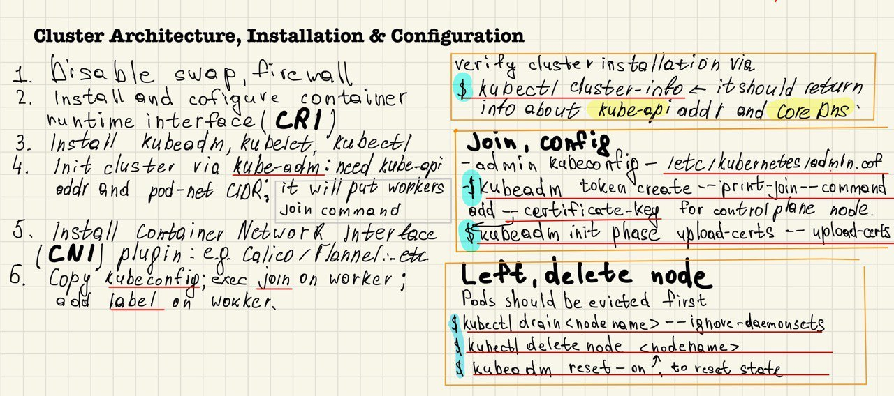

# Certified Kubernetes Administrator (CKA)

Буду краток, у вас мало времени: Certified Kubernetes Administrator [(CKA)](https://www.cncf.io/certification/cka/) один из крутейших сертификатов.

## Articles

Нашел пару хороших ресурсов, чтобы с чего начать:
- [devopscube about CKA](https://devopscube.com/cka-exam-study-guide/) - очень много хороших советов и кросс-ссылок, добавил сайт в закладки
- [medium](https://medium.com/4th-coffee/passing-the-cka-certified-kubernetes-administrator-exam-in-70-minutes-a-detailed-guide-dc945ba4065d) - на контрасте с предыдущей статьей как-то блекло
- [udemy](https://www.udemy.com/course/certified-kubernetes-administrator-with-practice-tests/) - для визуалов, учитель из 🇮🇳

## About Exam

Можно использовать:
- Второй монитор
- https://kubernetes.io/*
- https://github.com/kubernetes/

Говорят проходить [`the hard way`](https://github.com/kelseyhightower/kubernetes-the-hard-way) не обязательно.

| Theme | percentage | comment |
| ----- | ---------- | ------- |
| Cluster Architecture, Installation & Configuration | 25 % | `kubeadm`, Container Runtime Interface (CRI) |
| Workloads & Scheduling | 15 % | `workloads`; `nodes` |
| Services & Networking | 20 % | Container Network Interface (CNI) |
| Storage | 10 % | Container Storage Interface (CSI) |
| RBAC | X % | role based access |
| Troubleshooting | 30 % | see spoiler |

  
Toggle me!

  - What if a node is not ready?
  - What if a pod is frequently restarting, and you need to figure out why?
  - What if all CPU resource is used up and you need to find out which pod consumes the most and why?
  - How to monitor certain resources?
  - How to troubleshoot a failed component?

## Cluster Architecture, Installation & Configuration

Завел у себя дома кластер, мастер с одним воркером бегут поверх `ubuntu-desktop` моего старого ноутбука (4vcpu, 8gb ram), использую `vagrant+virtualbox`, `containerd` в качестве рантайма (CRI).

<!--truncate-->
