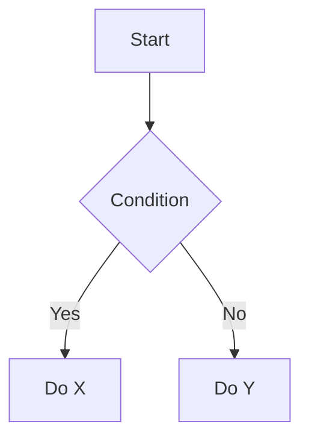

# Docusaurus Feature Reference

Cheatsheet for all supported features. Read before writing new docs.

---

## Frontmatter

```yaml
---
id: unique-page-id          # optional, defaults to filename
title: Page Title
sidebar_position: 1         # ordering within sidebar section
description: Short SEO description
tags: [devops, k8s]
---
```

---

## Admonitions

:::note
A neutral note.
:::

:::tip
A helpful tip.
:::

:::info
Informational content.
:::

:::warning
A warning.
:::

:::danger
A danger notice.
:::

Custom title:

:::note My Custom Title
Body text here.
:::

---

## Code Blocks

Syntax highlighting (supported languages: `bash`, `yaml`, `json`, `python`, `go`, `hcl`):

```bash
kubectl get pods -n kube-system
```

```yaml
apiVersion: apps/v1
kind: Deployment
metadata:
  name: my-app
```

```go
func main() {
    fmt.Println("hello")
}
```

### Line highlighting

```yaml {2-3}
key: value
highlighted: true   # line 2
also-highlighted: x # line 3
```

### Show filename

```bash title="deploy.sh"
helm upgrade --install my-app ./chart
```

---

## Tabs

import Tabs from '@theme/Tabs';
import TabItem from '@theme/TabItem';

<Tabs>
  <TabItem value="kubectl" label="kubectl" default>
    ```bash
    kubectl apply -f manifest.yaml
    ```
  </TabItem>
  <TabItem value="helm" label="Helm">
    ```bash
    helm upgrade --install my-app ./chart
    ```
  </TabItem>
  <TabItem value="terraform" label="Terraform">
    ```hcl
    resource "kubernetes_deployment" "example" {}
    ```
  </TabItem>
</Tabs>

---

## Category Metadata

Create `_category_.json` in any `docs/` subdirectory:

```json
{
  "label": "Kubernetes",
  "position": 2,
  "collapsible": true,
  "collapsed": false
}
```

---

## Links

Internal link (use relative paths or `useBaseUrl`):

```md
[See intro](./intro)
[See intro](/docs/intro)
```

External link:

```md
[Kubernetes docs](https://kubernetes.io/docs/)
```

---

## Images

Place images in `static/img/`:

```md

```

Or with `useBaseUrl` in MDX:

```tsx
import useBaseUrl from '@docusaurus/useBaseUrl';

```

---

## Mermaid Diagrams

> **Not yet enabled.** To enable, add `@docusaurus/theme-mermaid` and configure in `docusaurus.config.js`.

Once enabled:

````md

````

---

## Math / KaTeX

> **Not yet enabled.** To enable, add `remark-math` + `rehype-katex` to `docusaurus.config.js`.

Once enabled, inline: `$E = mc^2$` and block:

```
$$
\int_0^\infty e^{-x^2} dx = \frac{\sqrt{\pi}}{2}
$$
```

---

## MDX — Using React Components

Use `.mdx` extension and import components inline:

```mdx
import MyComponent from '@site/src/components/MyComponent';

<MyComponent title="Hello" />
```

---

## Docusaurus Config Notes

- `onBrokenLinks: 'throw'` — fix broken links, do NOT change this
- `baseUrl: '/Andrew-Horbach.github.io-Public/'` — prefix all absolute links
- Use relative links within `docs/` to avoid baseUrl issues
